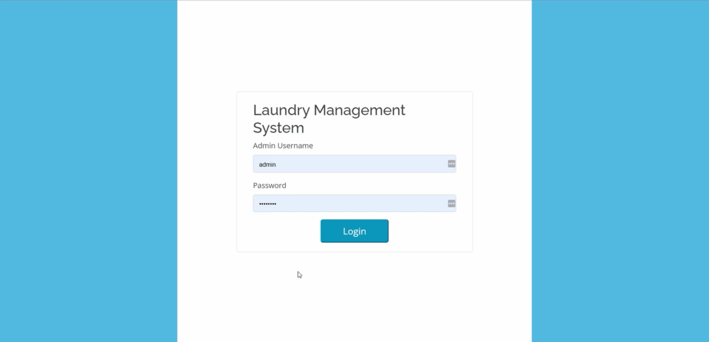
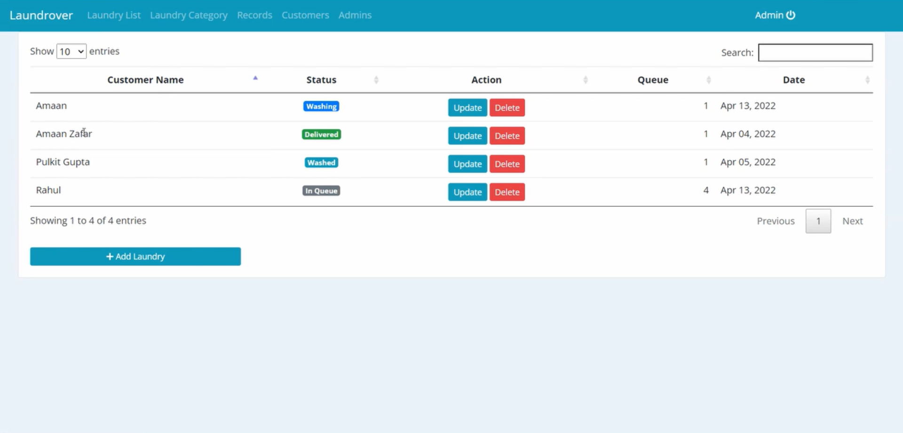
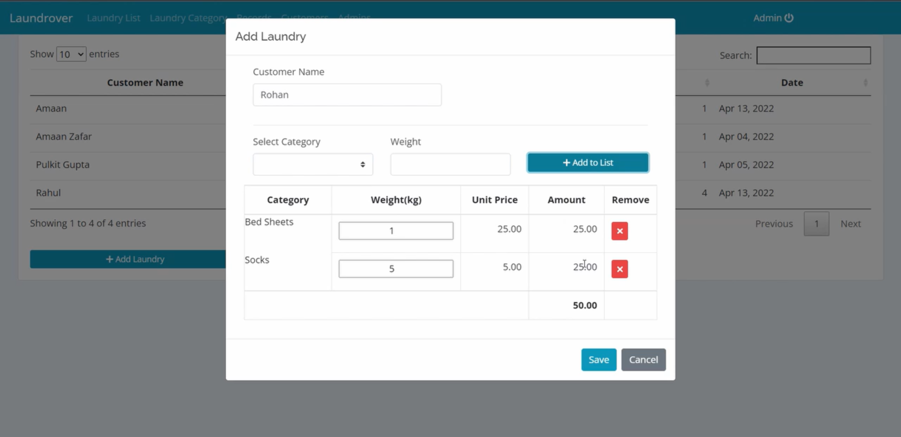
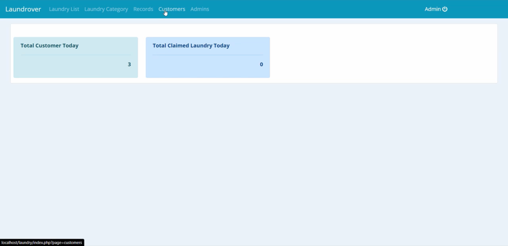
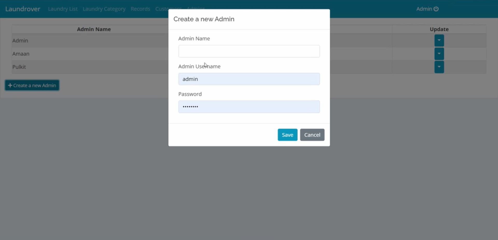

## **Laundrover** is a laundry management system.

# How to run the code on your local :
1. Download and install xampp
2. Move the code folder to xampp/htdocs
3. Start Apache and MySQL Server from Xampp Control Panel
4. Go to localhost in a browser
5. Open myPHPAdmin
6. Create a new database with name 'laundry'
7. Import laundry.sql from the code folder
8. Go to localhost/laundry to run the website on localhost
9. To login use: username=admin, password=admin123

# Screenshots from the app : 

